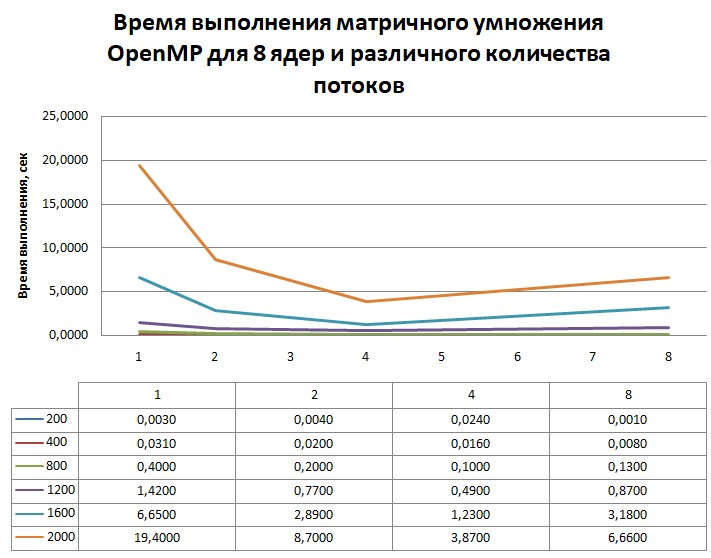
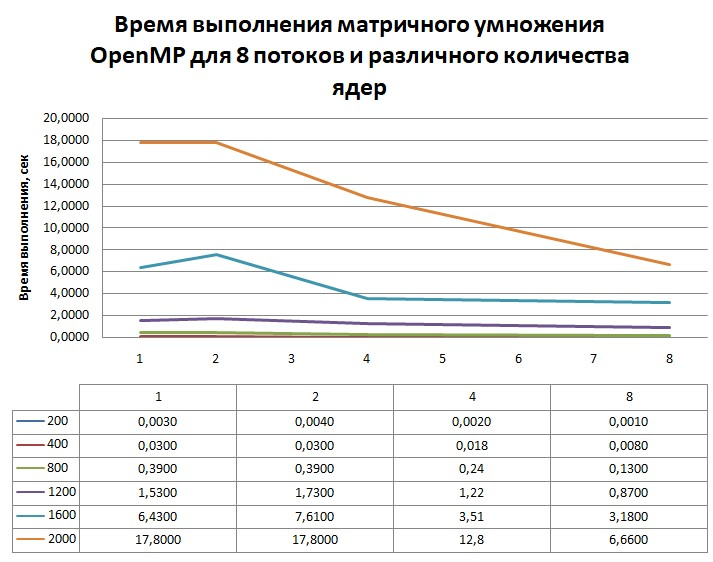

# Лабораторная работа по параллельному программированию №2

## Задание: 
Модифицировать программу из л/р №1 для параллельной работы по технологии OpenMP.  Провести серию экспериментов с разным количеством потоков (1, 2, 4, 8 и т.д.), разными размерами матриц (примерно 200, 400, 800, 1200, 1600, 2000), с разным количеством вычислительных ядер при наличии технической возможности (1, 2, 4, 8 и т.д.)

## Исходный код: 
```
#include <algorithm>
#include <chrono>
#include <fstream>
#include <iomanip>
#include <iostream>
#include <omp.h>
#include <vector>
#include <string>
#include <windows.h>

using namespace std;
using Clock = chrono::high_resolution_clock;

bool read_matrix(const string& filename, int& n, vector<double>& M) {
    ifstream in(filename + ".txt");
    if (!in) {
        cerr << "Cant open file for reading:  " << filename << "\n";
        return false;
    }
    if (!(in >> n)) {
        cerr << "Error reading matrix size from file: " << filename << "\n";
        return false;
    }
    if (n <= 0) {
        cerr << "Incorrect matrix size: " << n << "\n";
        return false;
    }
    M.assign((size_t)n * n, 0.0);
    for (int i = 0; i < n; ++i) {
        for (int j = 0; j < n; ++j) {
            if (!(in >> M[(size_t)i * n + j])) {
                cerr << "Error reading element (" << i << "," << j << ") from " << filename << "\n";
                return false;
            }
        }
    }
    return true;
}

bool write_matrix(const string& filename, int n, const vector<double>& M) {
    ofstream out(filename);
    if (!out) {
        cerr << "Cant open file for writing: " << filename << "\n";
        return false;
    }
    out << n << "\n";
    out << fixed << setprecision(4);
    for (int i = 0; i < n; ++i) {
        for (int j = 0; j < n; ++j) {
            out << M[(size_t)i * n + j];
            if (j + 1 < n) out << " ";
        }
        out << "\n";
    }
    return true;
}

void multiply(int n, const vector<double>& A, const vector<double>& B, vector<double>& C) {
    fill(C.begin(), C.end(), 0.0);
    C.assign((size_t)n * n, 0.0);

#pragma omp parallel for collapse(2) 
    for (int i = 0; i < n; ++i) {
        for (int j = 0; j < n; ++j) {
            double sum = 0.0;
            for (int k = 0; k < n; ++k) {
                sum += A[(size_t)i * n + k] * B[(size_t)k * n + j];
            }
            C[(size_t)i * n + j] = sum;
        }
    }
}

int main(int argc, char* argv[]) {
    if (argc != 4) {
        cerr << "Usage:\n"
            << "  " << argv[0] << " A B result \n\n"
            << "Input file formatting: first line - n (whole number, matrix size), next n lines with n numbers each (double).\n";
        return 1;
    }

    string fileA = argv[1];
    string fileB = argv[2];
    string fileOut = argv[3];
    int core_counts[4] = { 1,2,4,8 };
    int thread_counts[4] = { 1,2,4,8 };

    int nA = 0, nB = 0;
    vector<double> A, B, C;

    if (!read_matrix(fileA, nA, A)) return 2;
    if (!read_matrix(fileB, nB, B)) return 3;

    if (nA != nB) {
        cerr << "Matrices must be same size (n x n). nA=" << nA << ", nB=" << nB << "\n";
        return 4;
    }
    int n = nA;

    unsigned long long n64 = (unsigned long long)n;
    unsigned long long mults = n64 * n64 * n64;
    unsigned long long adds = mults > (unsigned long long)n64 * n64 ? (mults - n64 * n64) : 0;
    unsigned long long flops = mults + adds;
    size_t mem_bytes = 3 * (size_t)n * (size_t)n * sizeof(double);

    cout << "Matrix size n = " << n << "\n";
    cout << "Operation count: multiplications = " << mults
        << ", additions = " << adds << ", total FLOPs ~ " << flops << "\n";
    cout << "Memory (A,B,C) ~ " << mem_bytes << " bytes\n";


    for (int cores : core_counts) {
#ifdef _WIN32
        DWORD_PTR mask = (1ULL << cores) - 1;
        SetProcessAffinityMask(GetCurrentProcess(), mask);
#endif
        for (int threads : thread_counts) {
            omp_set_num_threads(threads);

            auto t0 = Clock::now();

            multiply(n, A, B, C);

            auto t1 = Clock::now();
            chrono::duration<double> elapsed = t1 - t0;
            double secs = elapsed.count();
            long long millis = chrono::duration_cast<chrono::milliseconds>(elapsed).count();
            string file = to_string(cores) + "cores" + to_string(threads) + "threads" + to_string(n);
            string resultFile = file + ".txt";
            if (!write_matrix(resultFile, n, C)) {
                cerr << "Error writing the result matrix\n";
                return 5;
            }

            cout << fixed << setprecision(6);
            cout << "Multiplication time: " << secs << " sec (" << millis << " ms)\n";

            string statsFile = file + "_stats.txt";
            ofstream st(statsFile);
            if (st) {
                st << "InputA: " << fileA << "\n";
                st << "InputB: " << fileB << "\n";
                st << "Output: " << fileOut << "\n";
                st << "n = " << n << "\n";
                st << "mults = " << mults << "\n";
                st << "adds = " << adds << "\n";
                st << "FLOPs ~ " << flops << "\n";
                st << "memory bytes (A,B,C) ~ " << mem_bytes << "\n";
                st << "time_sec = " << secs << "\n";
                st << "time_ms = " << millis << "\n";
                st.close();
                cout << "stats saved to " << statsFile << "\n";
            }
            else {
                cerr << "Error writing stats file: " << statsFile << "\n";
            }

        }

    }
    return 0;
}
```
## Результаты экспериментов:



## Выводы
Увеличение параметров распараллеливания наиболее эффективно для матриц большего размера  
На большем количестве ядер/потоков уменьшается прирост эффективности от дополнительных потоков/ядер, а после определенного момента эффективность начинает снижаться из-за затрат на управление потоками  
Как и ожидалось, при одном потоке и 8 ядрах наблюдается та же производительность, что и на 8 ядрах и одном потоке, так как избыточные потоки не задействуются (дополнительные эксперименты показывают, что 1 ядро будет давать одинаковую производительность при любом количестве потоков), и схожая ситуация наблюдается с недостатком потоков.
