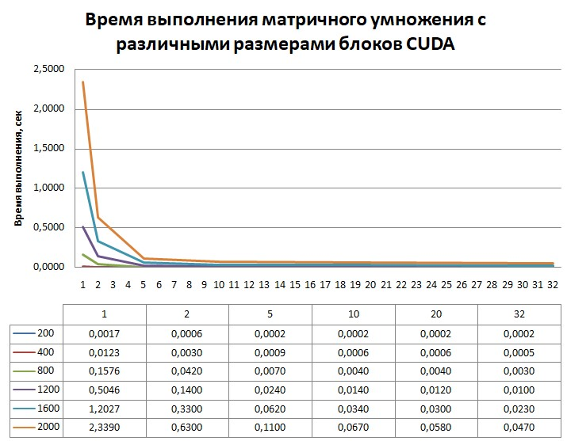

# Лабораторная работа по параллельному программированию №4

## Задание: 
 Модифицировать программу из л/р №1 для параллельной работы по технологии CUDA. Провести эксперименты с разными размерами матриц и различными конфигурациями сетки блоков.

## Исходный код: 
```
#include <iostream>
#include <fstream>
#include <vector>
#include "cuda_runtime.h"

using namespace std;

#define CHECK(call) \
{ \
    const cudaError_t error = call; \
    if (error != cudaSuccess) { \
        cout << "CUDA Error: " << cudaGetErrorString(error) << endl; \
        exit(1); \
    } \
}

__global__ void matrixMultiplyKernel(
    long long* A,
    long long* B,
    long long* C,
    int n)
{
    int i = blockIdx.y * blockDim.y + threadIdx.y;
    int j = blockIdx.x * blockDim.x + threadIdx.x;

    if (i < n && j < n) {
        long long sum = 0;
        for (int k = 0; k < n; ++k)
            sum += A[i * n + k] * B[k * n + j];

        C[i * n + j] = sum;
    }
}

void readMatrix(const string& filename, vector<long long>& matrix, int n)
{
    ifstream file(filename);
    for (int i = 0; i < n * n; ++i)
        file >> matrix[i];
}

int main(int argc, char* argv[])
{
    if (argc < 5) {
        cout << "Usage: matrix_cuda <n> <A.txt> <B.txt> <block_size>\n";
        return 1;
    }

    int n = stoi(argv[1]);
    string fileA = argv[2];
    string fileB = argv[3];
    int blockSize = stoi(argv[4]);

    size_t bytes = n * n * sizeof(long long);

    vector<long long> h_A(n * n);
    vector<long long> h_B(n * n);
    vector<long long> h_C(n * n);

    readMatrix(fileA, h_A, n);
    readMatrix(fileB, h_B, n);

    long long* d_A, * d_B, * d_C;

    CHECK(cudaMalloc(&d_A, bytes));
    CHECK(cudaMalloc(&d_B, bytes));
    CHECK(cudaMalloc(&d_C, bytes));

    CHECK(cudaMemcpy(d_A, h_A.data(), bytes, cudaMemcpyHostToDevice));
    CHECK(cudaMemcpy(d_B, h_B.data(), bytes, cudaMemcpyHostToDevice));

    dim3 block(blockSize, blockSize);
    dim3 grid((n + block.x - 1) / block.x,
        (n + block.y - 1) / block.y);

    cudaEvent_t start, stop;
    cudaEventCreate(&start);
    cudaEventCreate(&stop);

    cudaEventRecord(start);

    matrixMultiplyKernel << <grid, block >> > (d_A, d_B, d_C, n);

    cudaEventRecord(stop);
    cudaEventSynchronize(stop);

    float milliseconds = 0;
    cudaEventElapsedTime(&milliseconds, start, stop);

    CHECK(cudaMemcpy(h_C.data(), d_C, bytes, cudaMemcpyDeviceToHost));

    cout << "\nMatrix size: " << n << "x" << n << endl;
    cout << "Block size: " << blockSize << "x" << blockSize << endl;
    cout << "Grid size: " << grid.x << "x" << grid.y << endl;
    cout << "Execution time: " << milliseconds / 1000.0 << " seconds\n";
    cout << "Operations: " << 2LL * n * n * n << endl;

    cudaFree(d_A);
    cudaFree(d_B);
    cudaFree(d_C);

    return 0;
}
```
## Результаты экспериментов:


## Выводы
Увеличение параметров распараллеливания наиболее эффективно для матриц большего размера
При дальнейшем увеличении размера блока уменьшается прирост производительности
Для небольших матриц потеря эффекта от доп. процессах наступает на меньших размерах блоков, что может быть обусловлено большей ролью оверхеда по сравнению с малым объемом вычислений
Больший размер блока является оптимальным из-за скрытия задержек доступа к памяти и более эффективного использования ресурсов, меньшие затраты на управление блоками при одинаковом количестве потоков
