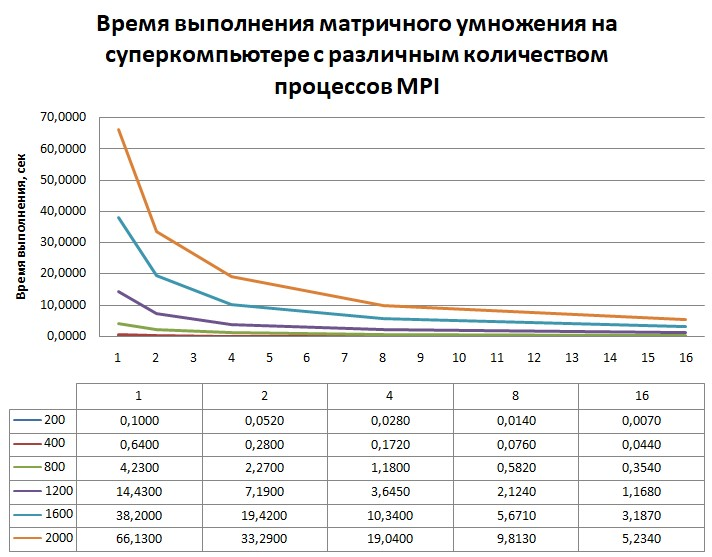

# Лабораторная работа по параллельному программированию №5

## Задание: 
Параллельную версию программы на MPI запустить на суперкомпьютере «Сергей Королёв».

## Исходный код: 
```
#include <sstream>
#include <chrono>
#include <fstream>
#include <iostream>
#include <vector>
#include <string>
#include <mpi.h>

using namespace std;
using Clock = chrono::high_resolution_clock;

std::vector<int> read_matrix(string filename, int& n) {
    ifstream in(filename);
    std::vector<int> matrix;
    std::string line;
    n = 0;
    while (getline(in, line)) {
        std::stringstream stream(line);
        int num, count = 0;
        while (stream >> num) {
            matrix.push_back(num);
            count++;
        }
        if (n == 0) n = count;
    }
    in.close();
    return matrix;
}


bool write_matrix(const string& filename, int n, const vector<int>& M) {
    ofstream out(filename);
    if (!out) {
        cerr << "Can't open file for writing: " << filename << "\n";
        return false;
    }
    out << n << "\n";
    for (int i = 0; i < n; i++) {
        for (int j = 0; j < n; j++) {
            out << M[i * n + j] << " ";
        }
        out << std::endl;
    }
    out.close();
    return true;
}

void multiply_parallel(int n, int rows_per_proc, const vector<int>& A, const vector<int>& B, vector<int>& C) {
    for (int i = 0; i < rows_per_proc; i++) {
        for (int j = 0; j < n; j++) {
            int sum = 0;
            for (int k = 0; k < n; k++) {
                sum += A[i * n + k] * B[k * n + j];
            }
            C[i * n + j] = sum;
        }
    }
}

int main(int argc, char* argv[]) {
    MPI_Init(&argc, &argv);

    int rank, size;
    MPI_Comm_rank(MPI_COMM_WORLD, &rank);
    MPI_Comm_size(MPI_COMM_WORLD, &size);
    std::vector<int> sizes = { 200, 400, 800, 1200, 1600, 2000 };

    if (argc != 4) {
        if (rank == 0) {
            cerr << "Usage:\n"
                << "mpiexec -n <num_procs> " << argv[0] << " A B result\n\n"
                << "Input file formatting: first line - n (whole number, matrix size), next n lines with n numbers each (double).\n";
        }
        MPI_Finalize();
        return 1;
    }

    string fileA = argv[1];
    string fileB = argv[2];
    string fileOut = argv[3];
   

    for (int n : sizes) {
        int rows_per_proc = n / size;
        std::vector<int> A, B, C;
        std::vector<int> local_A(rows_per_proc * n);
        std::vector<int> local_C(rows_per_proc * n);

        if (rank == 0) {
            int temp_n;
            A = read_matrix(fileA + '_' + to_string(n)+".txt", temp_n);
            if (temp_n != n) {
                cerr << "Wrong matrix size\n";
                return 1;
            }
            B = read_matrix(fileB + '_' + to_string(n) + ".txt", temp_n);
            if (temp_n != n) {
                cerr << "Wrong matrix size\n";
                return 1;
            }
            C.resize(n * n);
        }

        if (rank != 0) B.resize(n * n);
        MPI_Bcast(B.data(), n * n, MPI_INT, 0, MPI_COMM_WORLD);
        MPI_Scatter(A.data(), rows_per_proc * n, MPI_INT, local_A.data(), rows_per_proc * n, MPI_INT, 0, MPI_COMM_WORLD);

        auto start = std::chrono::high_resolution_clock::now();

        multiply_parallel(n, rows_per_proc, local_A, B, local_C);

        MPI_Gather(local_C.data(), rows_per_proc * n, MPI_INT, C.data(), rows_per_proc * n, MPI_INT, 0, MPI_COMM_WORLD);

        if (rank == 0) {
            auto end = std::chrono::high_resolution_clock::now();
            auto time = std::chrono::duration_cast<std::chrono::microseconds>(end - start).count();
            std::cout << size << "," << n << "," << time << std::endl;
            write_matrix(fileOut + '_' + to_string(n) + '_' + to_string(size) + ".txt", n, C);
        }
    }
    MPI_Finalize();
    return 0;
}
```
## Скрипт для постановки в очередь
```
#!/bin/bash
#SBATCH --job-name=lab3
#SBATCH --time=0:07:30
#SBATCH --ntasks-per-node=16
#SBATCH --partition batch

module load intel/mpi4
mpirun -r ssh ./lab3 A B C
```
## Результаты экспериментов:


## Выводы
Увеличение параметров распараллеливания наиболее эффективно для матриц большего размера  
Прирост эффективности наблюдается вплоть до максимального количества процессов, благодаря архитектуре суперкомпьютера  
